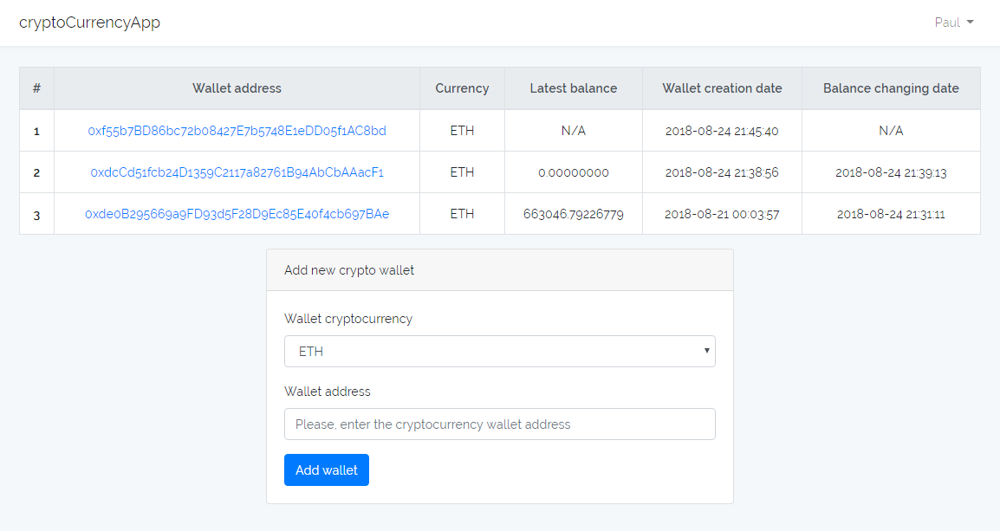
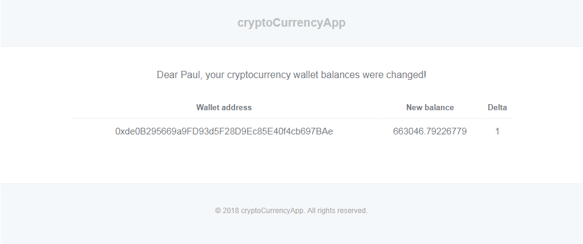

# cryptoStatsApp

PHP Laravel 5 Web application for managing the cryptocurrency wallets statistics. It contains the only one page at the current moment with a list of the user's wallets and a form for new cryptocurrency wallet adding. It looks like this:



### Docs

* [Features list](#features-list)
* [Installation](#installation)
* [Configuration](#configuration)
* [Futher plans](#futher-plans)

## Feautures list

cryptoStatsApp is a multi-user application with possibility of registration and authentication users for accessing the wallets added by them.

Freshly added wallets have **N/A** balance which will be updated passing the minute according to the crob job settings with the command `updatebalance`.

> Also you can run the balance updating manually whatever you want with the next Laravel artisan command:

```bash
php artisan updatebalance
```

You can find the scheduler record for the `updatebalance` command and change its execution interval in the file `app\Console\Kernel.php` at the following line:

```php
/**
* Define the application's command schedule.
*
* @param  \Illuminate\Console\Scheduling\Schedule  $schedule
* @return void
*/
protected function schedule(Schedule $schedule)
{
    $schedule->command(UpdateBalance::class)->everyMinute();
}
```

Also you need to add the following cron job task to the cronjob file at your server for running Laravel scheduler:

```bash
* * * * * cd /path-to-your-project && php artisan schedule:run >> /dev/null 2>&1
```
As noticed below, the `updatebalance` command will update the wallets balances and will send the email about changes in the next format:



> Email about the wallet balance changes will send only if the balance value in the database was changed. If there is the first record, email wouldn't be sent. Also notice if there are several wallets' balance changes at the time, the only one email will be send with the list of all wallets' changes.

Mailing works trought the queues, so, you need to setup the queue driver for your Laravel application with the `.env` parameter `QUEUE_DRIVER`. Also you need config the connections of your queue service. If you want to store queues in the database, run the artisan commands:

```bash
php artisan queue:table

php artisan migrate
```

After that you have to run the Laravel queue worker with the following shell command:

```bash
php artisan queue:work your_queue_driver --queue=emails
```

## Installation

Installation procedure for cryptoStatsApp is standard for all Laravel aplications and consists of the following steps:

1. Clone this repository at your machine.

2. Run shell command for istalling the Laravel framework, packages and their dependencies:

```bash
composer update
```

3. If you want to work with frontend, you should install Node.js (I used the last stable at the current moment - 8.11.3) with compatible NPM version at your machine and run next commands:

```bash
npm install
```

For working at the local machine with builded files/with changes wathing:

```bash
npm run dev/watch
```

Or for building minified files at the production environment server:

```bash
npm run prod
```

The full list of npm commands for managing this project you can find at the package.json file.

4. Create the Apache virtual domain with the root on the `rootFolder/public` directory manually or use deployment tools like `Docker`, `Vagrant`, `Laravel Homestead` to make it automaticlly.

5. Rename .env.example to the .env and config needed params with your values.

6. Generate the Laravel application key with the following shell command:

```bash
php artisan key:generate
```

7. Create the database (by default Laravel app uses the MySQL DB driver, if you need the other one, set it in the .env with the block of params with the DB_ prefix)

8. Run the Laravel migrations to create a database with this artisan command:

```bash
php artisan migrate
```

You can read about the installation and configuration of the Laravel application more detailly in the official [Laravel documentation](https://laravel.com/docs/5.6/installation) and, if you are a Russian speaker, - [here](http://cccp-blog.com/laravel/laravel-ustanovka).

## Configuration

This Laravel application has its own configuration which is located in the `config\constants.php` file. It consists of the following parameters:

```php
/**
* Degree of the balance rounding for displaying.
* Important! Can not be more than 8, because this number if decimals is set for DB field, so you can just decrease it
* If you want to increase it, change the schema of the DB table wallet_infos
*/
'rounding_degree' => 8,
    
 /**
 * The number of wallets per page at the address list
 */
 'wallets_per_page' => 10
```

For getting the cryptocurrency wallet information `cryptoStatsApp` uses the [laravel-crypto-stats](https://github.com/Pashaster12/laravel-crypto-stats) package which published its `laravel_crypto_stats.php` config in the `config` directory.

It consists of the array with the default currencies which is named as `currencies`. They will be displayed in the cryptoStatsApp at the new wallet adding form. So if you want to delete or add new supported by the package currency to this list, just add or remove it to this config variable.

List of the supported by the `laravel-crypto-stats` package currencies you may find at the package's readme file.

## Futher plans

- Make a single page application with Vue.js.
- Write feature and unit tests.
- Make separated application pages.
- Add charts and report export.
